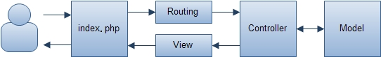

应用程序类
==================
负责初始化系统运行环境并执行应用程序，类自动加载实现，获取请求、响应对象，协调处理用户请求与处理,跳转分发等工作。

1、执行应用程序
---------------
我们再index.php中通过调用\wf\core\App类来执行应用程序。
```
require_once 'src/wf/App.php';
$app = \wf\core\App::getInstance();
// 执行应用程序
$app->dispatch(); 
```

2、程序执行流程
----------
  

3、应用程序跳转分发
----------------
\wf\core\App类提供接口支持站内页面请求转移到其它的控制器Acton（调用站内其他控制器的动作）
```
使用：
$this->dispatch("$mod.$ctl.$act/$id/$other");
或
$this->dispatch(array(
    'mod' => $mod,
    'ctl' => $ctl,
    'act' => $act,
    'params' => array('a', 'b', 'c'),
    'args' => array(),
));
```

4、获取请求对象
----------------------
```
\wf\core\App::getInstance()->getRequest();
```


5、获取响应对象
-----------------
```
\wf\core\App::getInstance()->getResponse();
```
<a name="autoload"></a>

6、自动加载类 
---------------------
Windwork实现自动加载类的功能，在系统运行时，根据类名自动加载src/wf和src/module目录下的类文件。
### 实现自动加载类的代码
```
	spl_autoload_register(function($class) {
		$src = strtr($class, '\\', '/');
		$src = trim($src, '/');
		$src = SRC_PATH."{$src}.php";
		
		return include $src;
	}, false, true);
```
